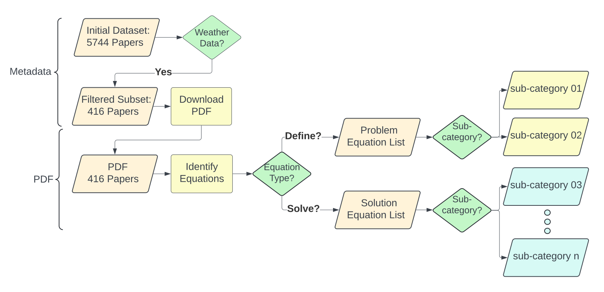

# README.md

## Fire Weather Papers Survey
**Analyzing Themes, Equations, and Metadata in Computer Science Wildfire Research PDFs**

---

## Description

This project analyzes a collection of PDFs related to computer science wildfire research to extract **themes**, **equations**, and **metadata**. The analysis focuses on identifying patterns within **problem domain equations (PDE)** and **solution domain equations (SDE)**, highlighting themes, datasets, and their relationships, and categorizing findings into meaningful outputs. The goal is to model both the **problems** and **solutions** expressed in the papers as equations, datasets, and themes.

---

## Key Objectives

1. **Identify Equations**  
   - Extract equations (mathematical or verbal) from PDFs.
   - Classify equations into:
     - **Problem Domain Equations (PDE)**: Define the research problem.
     - **Solution Domain Equations (SDE)**: Provide methods, models, and solutions.

2. **Analyze Themes**  
   - Identify co-occurrences between themes using predefined keywords.
   - Extract recurring datasets, regions, and themes.

3. **Model Results**  
   - Express findings as equations.
   - Quantify the relationships between PDEs, SDEs, datasets, and themes.

4. **Visualize Trends**  
   - Generate bar charts and visualizations to summarize:
     - PDE and SDE subcategories.
     - Theme co-occurrences.
     - Dataset occurrences.

---

## Input Data

The input consists of:
- **PDF Collection**: Wildfire research papers.
- **Keywords**: A `keywords.json` file specifying themes, datasets, and equation categories.

---

## Workflow

### 1. **Metadata Analysis**
- **Script**: `classify_metadata.py`
- **Purpose**:  
   - Extract metadata from PDFs (e.g., author, year, title).  
   - Analyze patterns in metadata to complement theme and equation analysis.

---

## Outputs

1. **Text Reports**:  
   - Theme analysis summary.
   - Equation classification summary.
   - Co-occurrence analysis report.

2. **Visualizations**:  
   - **Theme Co-Occurrence**: Bar charts and heatmaps.
   - **PDE and SDE Subcategory Distribution**: Frequency charts for equation types.
   - **Paper Categorization**: Summary of PDFs containing PDEs, SDEs, or both.

3. **Research Insight Equation**:  
   The overall relationships can be expressed as:  

   ,SDE(P),D(P),T(P)\right))

   Where:  
   - : Research insights from the analysis.  
   - ): Problem Domain Equations in the PDFs \( P \).  
   - ): Solution Domain Equations in the PDFs \( P \).  
   - ): Datasets mentioned in the PDFs \( P \).  
   - ): Themes extracted from the PDFs \( P \).  

   The workflow for analyzing metadata is:

   

### 2. **Theme and Dataset Analysis**
- **Script**: `pdf_analyze_themes.py`
- **Purpose**:  
   - Extract and count mentions of predefined themes, datasets, and regions.  
   - Identify co-occurrences between themes and datasets.

   The workflow for analyzing themes is:

   

**Outputs**:
- A report listing:
  - Themes and their frequencies.
  - Dataset mentions.
  - Co-occurrence statistics between themes and datasets.

---

### 3. **Equation Analysis**
- **Script**: `pdf_analyze_equations.py`
- **Purpose**:  
   - Extract equations (mathematical and verbal) from PDFs.  
   - Categorize equations into:
     - **Problem Domain Equations (PDE)**: Problem formulation, boundary conditions, etc.
     - **Solution Domain Equations (SDE)**: Optimization techniques, predictive models, etc.  

   The workflow for analyzing equations is:

   

**Outputs**:
- A report classifying equations by subcategory.
- Summary of PDFs with PDEs, SDEs, or both.

---

## Installation and Dependencies

### Prerequisites
- Python 3.x

### Required Libraries:
- pdfplumber
- PyPDF2
- matplotlib
- collections
- json
